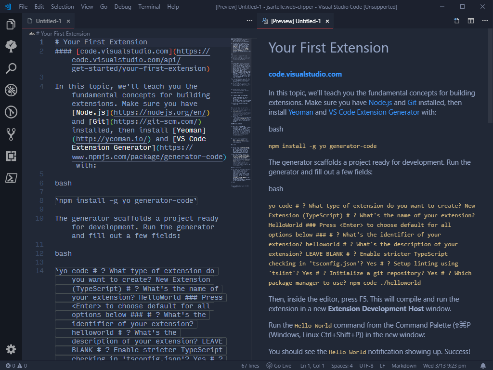

# Web Clipper

Clip web pages into Markdown, similar to Evernote or OneNote.

## Features

Clip the contents of a web page into a Markdown document using the `Web Clipper: Clip Web Page` command.

You can also open VS Code and clip a page using the following URI format: `vscode://jsartelle.web-clipper/clip?url={URL}`

The extension uses the [Mercury parser](https://github.com/postlight/mercury-parser) to extract the main content from a page. The HTML to Markdown conversion is handled by [Turndown](https://github.com/domchristie/turndown).

## Requirements

None.

## Extension Settings

This extension contributes the following settings:

* `webClipper.autoShowPreviewToSide`: Automatically open a preview to the side after a page is clipped.
* `webClipper.outputTemplate`: A custom template that the results will be interpolated into. For example, you can add the title and publication date to your clips. See the settings editor for more information.
* `webClipper.turndownOptions`: Options to pass to Turndown. A list of valid options can be found [here](https://github.com/domchristie/turndown#options). Advanced options are not supported.

## Known Issues

None!